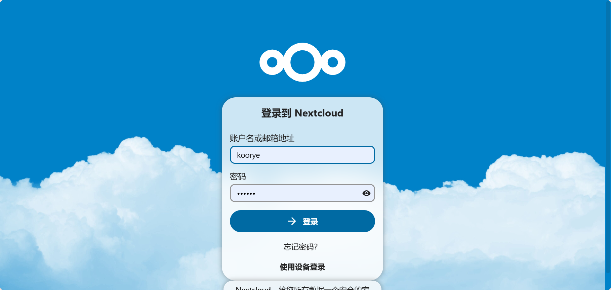
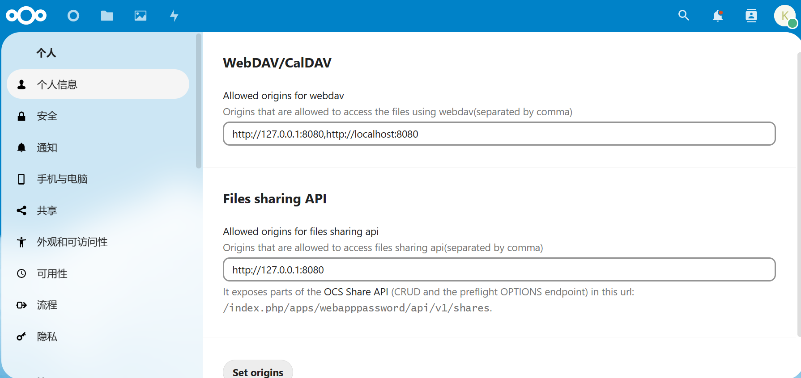
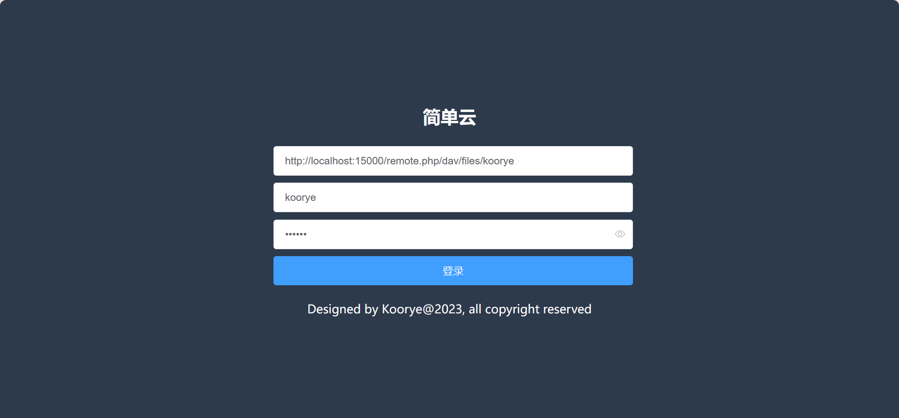
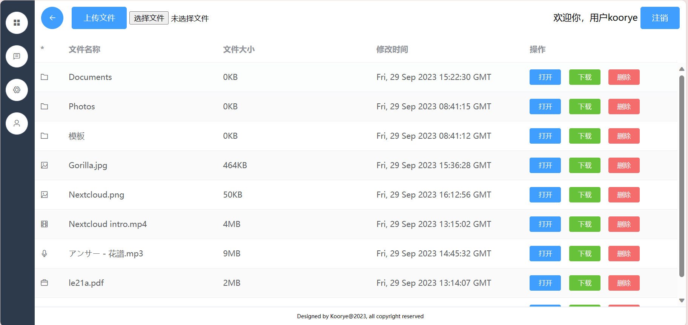

# Simple Cloud
A simple cloud webdav browser client by Vue, for school homework :)

Functions:
1. Upload/Download files.
2. (Move TODO)/Delete files.
3. Preview image/video/audio/pdf/markdown/text files online.

## Server
The default server is nextcloud. You need to modify some field in `docker-compose.yml`, such as volumes and password.

**Start server**
```shell
cd server/
docker-compose up -d
```

Then you can visit the nextcloud server from `http://localhost:15000`.



After launch the server, you should install application `WebAppPassword` in the nextcloud app store, then add `http://localhost:8080` to "Allowed origins for webdav" in the manage settings.



## Client

**Install dependencies**
```shell
npm install
```

**Start client**
```shell
npm run dev
```

Then you can visit the client from `http://localhost:8080`.





## Thanks
This client is based on [webdav-client](https://github.com/perry-mitchell/webdav-client), thanks to the authors for their contribution!